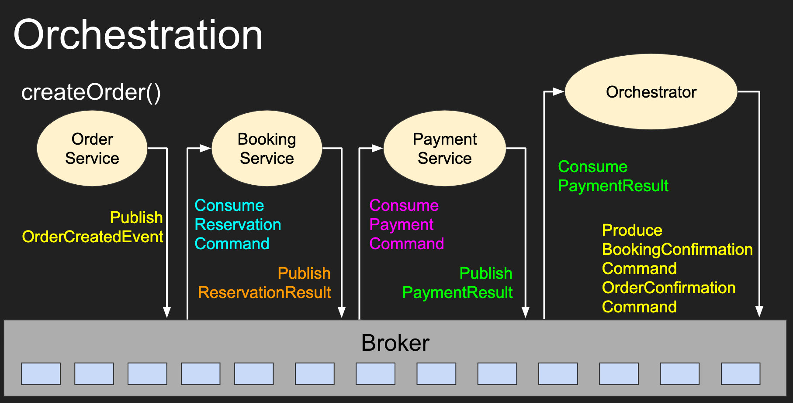

# Saga Demo

Slides are available at <http://bit.ly/sagakafka>

To Execute this project, clone the repository, `cd` into it, and execute:

    docker-compose up

You can use the [Insominia file](Insomnia.json) to POST a `new order` to <http://localhost:8080/orchestration/order>

You can download Insominia from <https://insomnia.rest/download/core/>

If you have Insominia installed, just click on the button bellow:

## Overall Architecture

## Services information

The docker-compose file executes the following services

- **mongodb** - Used to store `rooms` documents.

    Port: 279017

- **mongoexpres** - Mongo UI

    Port: 8083
    
    Available at <http://localhost:8083/>

- **mysql** - Used to store `order` and `balance` tables. 
    
    Port: 3306

- **zookeeper** and **kafka** - Kafka Broker

    Ports: 9092 (Inside docker network) / 19092 (To connect from outside docker network)

- **kafkadrop** - Kafka Web UI 

    Available at <http://localhost:9000/>

- **order** - Written in [`NodeJS/ExpressJS`](https://expressjs.com/), Receive `order` requests and process `order` commands.

    Port: 8080
    
- **booking** - Written in [`Spring Boot`](https://spring.io/projects/spring-boot), Process `reservation` requests.

    Port: 8081

- **payment** - Written in [`MicroProfile/Helidon`](https://helidon.io/), Process `payment` requests.

    Port: 8082

- **orchestrator** - Written in [`Kafka Streams`](https://kafka.apache.org/25/documentation/streams/). Coordinate the calls between the Kafka Topics from different services.

    This service doesn't expose any ports.